# LungCT3DNoduleAI — AI 기반 폐 CT 3D 시각화 및 결절 탐지 시스템

🇰🇷 한국어 · 🇬🇧 [English](README.en.md)

> *AI-Based Lung Nodule Detection System Using Chest CT Images*
>
> 환자가 자신의 폐 CT 를 업로드하면 **3D 로 재구성하고 결절 의심 부위를 색으로 표시**해주는 시스템입니다. *"영상 판독까지 평균 수일, 그 사이 환자는 불안 속에 정보 단절을 겪는다"* 는 문제를, 진단 대체가 아닌 *"진단 전후의 공백을 메우는 참고 도구"* 로 풀어보려 한 학부 종합설계 프로젝트입니다. 본인은 6 인 팀 **T.O.P** 의 **PM (Project Manager)** 으로 일정·진척도·업무 분담을 관리하고 데이터 전처리를 담당했습니다. 2025년 1학기 의료IT공학과 *융합설계 및 프로젝트Ⅰ (종합설계)* 의 결과물입니다.

     -yellow) -lightgrey)

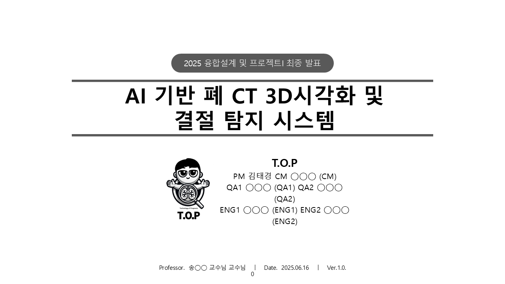

> 최종 발표 표지 — **T.O.P** (Technology Of Prognosis, *"예측 기술"*) · 2025.06.16 · Ver.1.0.0

---

## ⚠ 빌드/실행 상태에 관하여

본 레포는 **2025년 6월 발표 시점의 코드를 그대로 보존**합니다. 자매 프로젝트 [`MedQueue`](https://github.com/MoriochoRadio/MedQueue) (Xamarin 지원 종료로 빌드 불가) 와 달리, 본 프로젝트는 Python 3.9.21 + PyTorch + Streamlit 환경으로 작성 시점에는 실행 가능했습니다.

다만 다음을 유의해야 직접 실행할 수 있습니다:
- **학습 데이터는 포함되지 않습니다.** LIDC-IDRI (TCIA 공개 폐 CT-DICOM) 를 직접 다운로드해야 합니다 ([다운로드 가이드](#-데이터셋--학습--성능)).
- **모델 가중치** (`models/dhkstjd.pth`, 52 MB) 는 Git LFS 로 push 되어 있습니다. clone 시 `git lfs pull` 필요.
- **코드 안 경로**는 학습 당시 학교 공용 PC 의 절대 경로 (`C:/Users/<PC_A>/Desktop/spiral_torch/...`) 가 `<PC_A>` 로 마스킹되어 있어, 본인 환경에 맞게 수정해야 합니다.
- 실행: `streamlit run src/test2.py`

---

## 📚 프로젝트 컨텍스트

| 항목 | 내용 |
|---|---|
| **시기** | 2025학년도 1학기 (발표: 2025.06.16) |
| **소속** | 건양대학교 의료IT공학과 |
| **과목** | 융합설계 및 프로젝트Ⅰ (종합설계), 3학년 1분반 |
| **지도교수** | 송◯◯ 교수님 |
| **팀** | **T.O.P** (Technology Of Prognosis, *"예측 기술"*) — 6 인 |
| **팀 구성** | **PM 김태경 (본인)** / CM ◯◯◯ / QA1 ◯◯◯ / QA2 ◯◯◯ / ENG1 ◯◯◯ / ENG2 ◯◯◯ |
| **본인 (KimTaeKyoung) 역할** | ★ **PM (프로젝트 총괄 · 일정 관리 · 진척도 관리 · 업무 분담) + 데이터 전처리 (DICOM → mesh → vertex)** |
| **본인 1차 저자 산출물** | 5 종 — 팀프로젝트 편성서 · 프로젝트 제안서 · 초기 개발 기획서 · 개발 완료 보고서 · MS Project |
| **AI 모델 / Streamlit UI** | ENG1 / ENG2 메인 (본인 미담당 — 아래 [*본인 기여*](#-본인-기여-kimtaekyoung--pm--데이터-전처리) 참조) |

> 📌 본 프로젝트는 본인 포트폴리오에서 **"AI" 부분이 처음 완성된 프로젝트**입니다. 이전 [`MedQueue`](https://github.com/MoriochoRadio/MedQueue) (환자 대기) · [`SchoolbusRFID`](https://github.com/MoriochoRadio/SchoolbusRFID) (어린이 안전) · [`ElderCaringApp`](https://github.com/MoriochoRadio/ElderCaringApp) (노인 케어) 가 *앱·IoT* 였다면, 본 프로젝트는 *첫 본격 딥러닝 의료 영상* 프로젝트이자 *첫 PM 경험* 입니다.

---

## ❓ 문제 정의

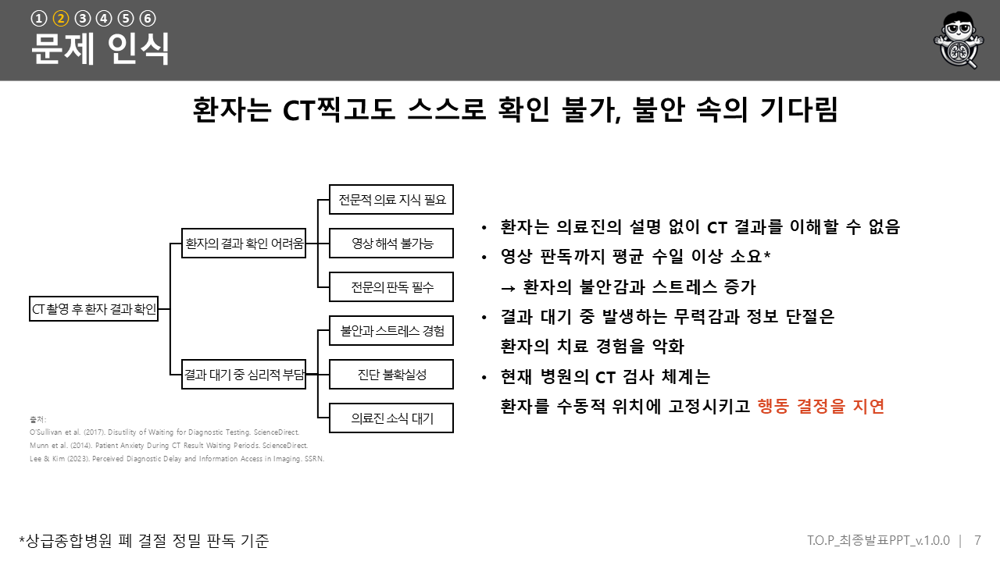

본 프로젝트는 폐 CT 진단을 둘러싼 세 가지 문제에서 출발했습니다:

1. **폐암 사망률 1위** — 한국 암 사망 원인 중 폐암이 1위. 조기 발견이 생존율을 크게 좌우합니다.
2. **환자 정보 단절** — *"환자는 의료진의 설명 없이 CT 결과를 이해할 수 없고, 영상 판독까지 평균 수일 이상 소요된다. 결과 대기 중 발생하는 무력감과 정보 단절은 환자의 치료 경험을 악화시킨다."* (O'Sullivan et al. 2017, Munn et al. 2014, Lee & Kim 2023 인용)
3. **환자용 시스템 부재** — 기존 영상 판독 시스템은 모두 의료진용. 환자가 *"내 CT 가 어떤 상태인지"* 스스로 참고할 수 있는 도구는 거의 없습니다.

---

## 💡 솔루션

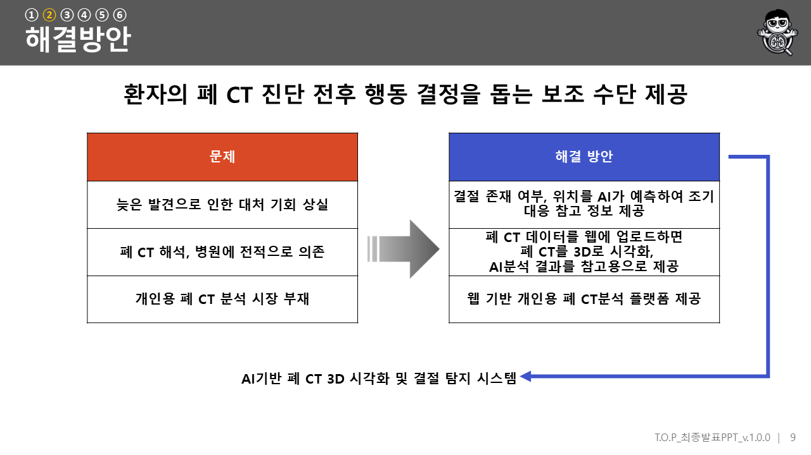

> *"환자의 폐 CT 진단 전후 행동 결정을 돕는 보조 수단 제공."*

**진단을 대체하는 것이 아니라, 진단 전후의 공백을 메우는 참고 도구**가 본 프로젝트의 핵심 포지셔닝입니다. 사용자 시나리오:

1. CT-DICOM 파일을 zip 으로 압축해 웹사이트에 업로드
2. 시스템이 압축을 해제하고 CT 데이터를 처리
3. 화면에 폐 CT 영상 + 분석 결과 + 3D 이미지 출력
4. **3D 이미지에서 결절 의심 부위를 색으로 표시**
5. 결과를 파일로 저장해 활용

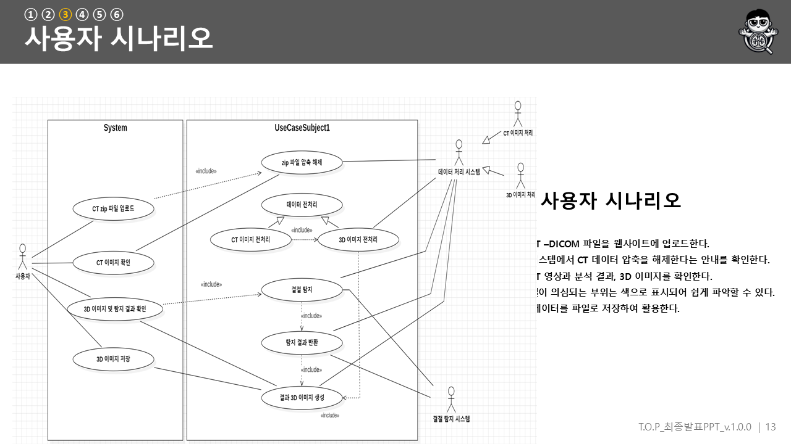

### 3D 시각화 — 색으로 읽는 결절

| 색 | 의미 |
|---|---|
| 회색 점 (Lung BG) | 폐 구조 (예측 대상 아님) |
| 노란 점 (GT Nodule) | 실제 결절 위치 (정답) |
| 빨간 점 (Predicted) | 모델이 예측한 결절 위치 |
| 주황 점 (Correct) | 모델이 예측했고 실제로도 결절인 위치 |

---

## 🛠️ 기술 스택

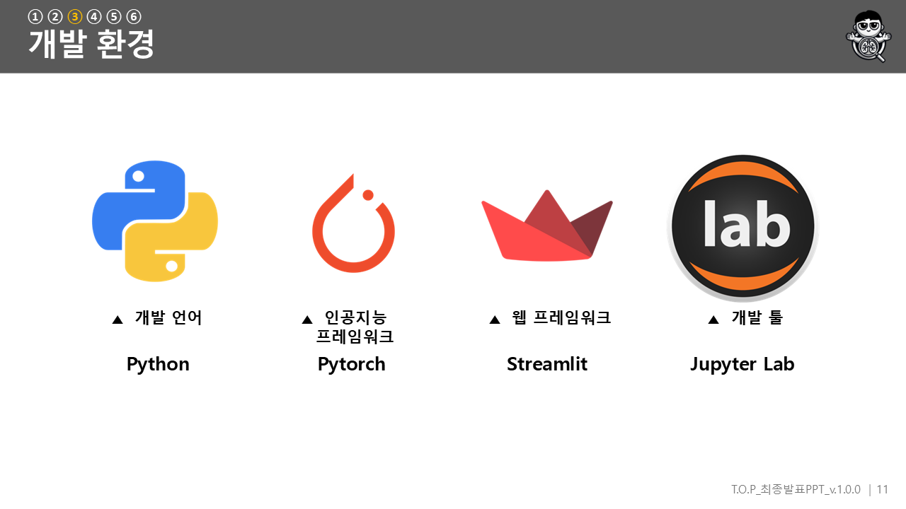

| 영역 | 기술 |
|---|---|
| **언어 / 환경** | Python 3.9.21 · Jupyter Lab |
| **딥러닝** | PyTorch (SpiralNet + PointNet + Transformer + MeshCNN 4-branch 하이브리드) |
| **의료 영상** | pydicom (DICOM 로드) · trimesh + scikit-image marching cubes (mesh 생성) · scipy (3D resample) |
| **웹 UI** | Streamlit |
| **시각화** | matplotlib · 3D point cloud rendering |

전체 의존성은 [`requirements.txt`](requirements.txt) 참조. 본 파일은 코드의 `import` 문을 분석해 자동 생성되었습니다.

---

## 🏗️ 시스템 설계

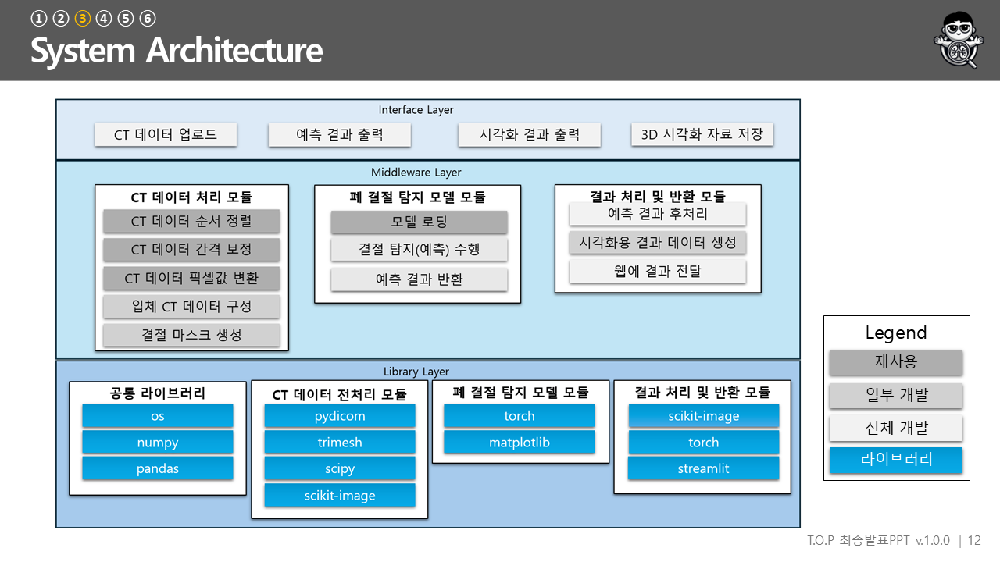

전체 파이프라인은 *"DICOM 업로드 → 전처리 → 3D mesh 변환 → 4-branch 모델 추론 → 3D 시각화"* 입니다.

```
┌─────────────────────────────────────────────────────────────────┐
│  사용자: CT-DICOM zip 업로드 (Streamlit 웹)                         │
└────────────────────────────┬────────────────────────────────────┘
                             ▼
┌─────────────────────────────────────────────────────────────────┐
│  ★ 데이터 전처리 ( 영역, src/test2.py 12 함수 247 줄)            │
│  find_dicom_files → load_scan → get_pixels_hu (HU 변환)           │
│  → resample (spacing 보정) → segment_lung_mask (marching cubes)   │
│  → mesh 생성 → vertex 7-feature → .npy                            │
└────────────────────────────┬────────────────────────────────────┘
                             ▼
┌─────────────────────────────────────────────────────────────────┐
│  AI 모델 (ENG 설계·학습): 4-branch 하이브리드                       │
│  ┌──────────────┬──────────────┬──────────────┬───────────────┐  │
│  │ ImprovedSpiral│   PointNet   │  Transformer │   MeshCNN     │  │
│  │ Net (mesh conv│  (point      │ (self-       │  (edge        │  │
│  │ + SE + skip)  │   feature)   │  attention)  │   feature)    │  │
│  └──────┬───────┴──────┬───────┴──────┬───────┴───────┬───────┘  │
│         └──── ensemble (spiral+pointnet)/2 ────┘   + 분류         │
└────────────────────────────┬────────────────────────────────────┘
                             ▼
┌─────────────────────────────────────────────────────────────────┐
│  3D 시각화 (결절 의심 부위 색 표시) + 결과 저장                       │
└─────────────────────────────────────────────────────────────────┘
```

---

## 🤖 모델 구조

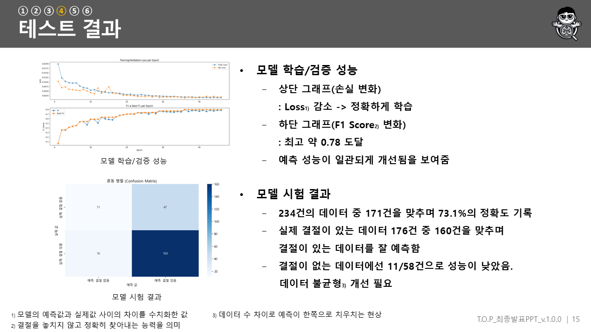

4-branch 하이브리드 모델 (`HybridSpiralNetPointNetTransformer`) 은 mesh / point cloud / attention / edge 네 관점에서 폐 결절을 탐지합니다:

| Branch | 클래스 | 역할 |
|---|---|---|
| 1 | `ImprovedSpiralNet` (68줄) | multi-scale SpiralConv encoder-decoder + Squeeze-Excitation + skip connection |
| 2 | PointNet MLP | point feature → global pooling |
| 3 | `SimplePointTransformerBlock` | multi-head self-attention (heads=4) |
| 4 | `MeshCNN` | mesh edge feature + 결절 유무 분류 |

학습은 클래스 불균형 대응을 위해 `AdaptiveFocalLoss` + Dice Loss + Hard Negative Mining 을 통합한 `HybridLoss` (focal 0.7 / dice 0.3) 를 사용했습니다.

> ⚠ **정직 명시**: 위 모델 구조의 설계·학습은 **ENG1 / ENG2 가 메인으로 담당**했습니다. 본인 (PM) 의 코드 영역은 데이터 전처리였습니다 — 자세한 분담은 아래 [*본인 기여*](#-본인-기여-kimtaekyoung--pm--데이터-전처리) 참조.

---

## ✨ 주요 기능 / UI

| Streamlit 메인 화면 | 결과 화면 |
|---|---|
| 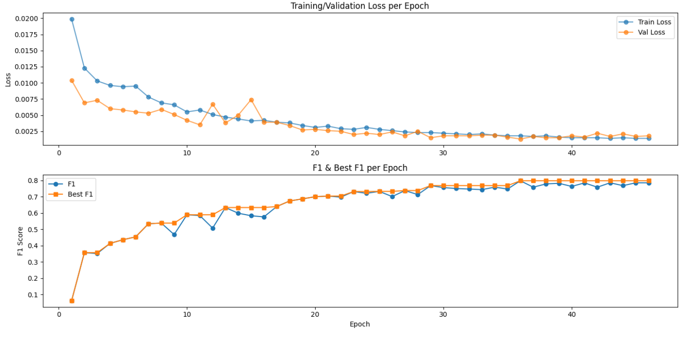 | 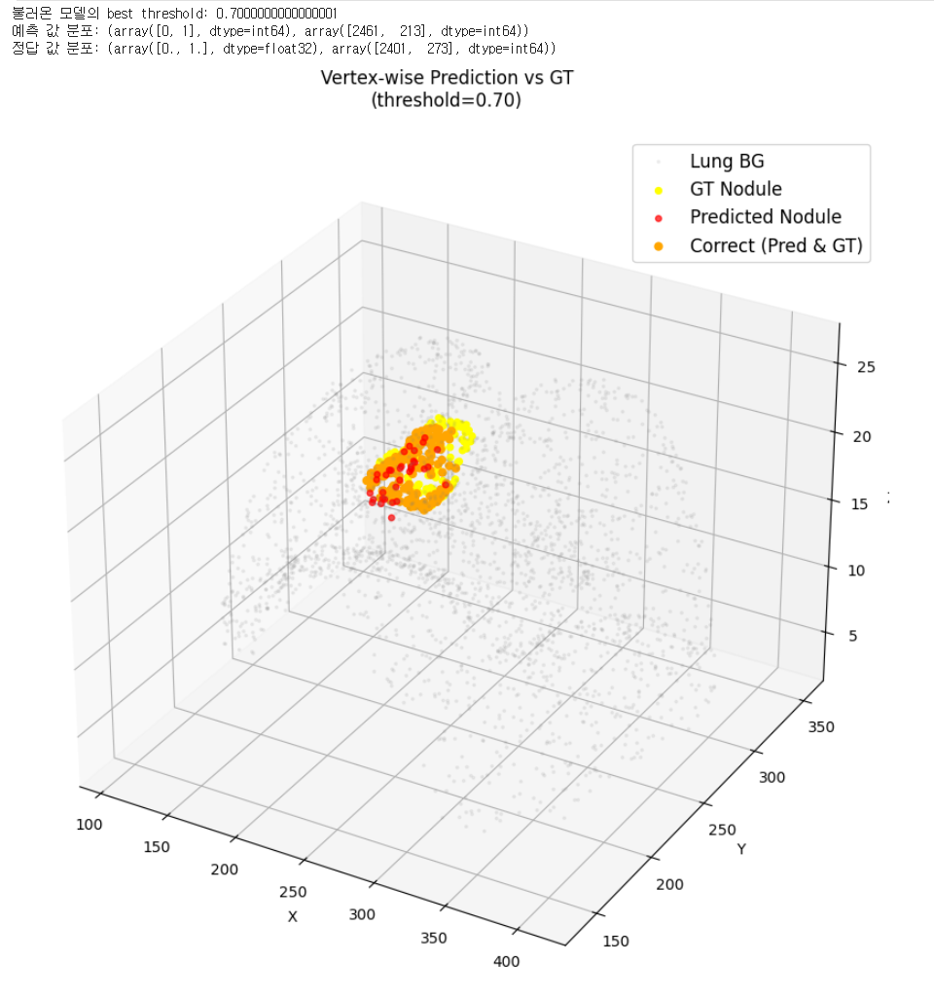 |

### 시연 영상

<video src="assets/videos/demo_main.mp4" controls width="800"></video>

> 위 영상이 안 보이면 [`assets/videos/demo_main.mp4`](assets/videos/demo_main.mp4) 직접 재생 (1920×1080, 0:33 — 발표 PPT slide 17 임베드 영상).
> 실제 Streamlit 사용 녹화는 [`assets/videos/demo_streamlit_recording.mp4`](assets/videos/demo_streamlit_recording.mp4) (1:26).

---

## 📊 데이터셋 / 학습 / 성능

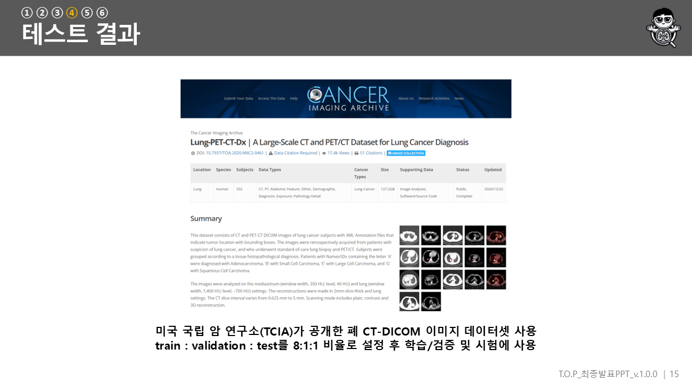

### 데이터셋 — LIDC-IDRI (TCIA)

> *"미국 국립 암 연구소(TCIA)가 공개한 폐 CT-DICOM 이미지 데이터셋 사용. train : validation : test 를 8:1:1 비율로 설정."*

- **데이터셋**: [LIDC-IDRI](https://www.cancerimagingarchive.net/collection/lidc-idri/) (Lung Image Database Consortium) — TCIA (The Cancer Imaging Archive) 호스팅, 미국 국립 암 연구소(NCI) 공개
- **분할**: train : val : test = 8 : 1 : 1
- **전처리**: DICOM → HU 변환 → 폐 분할 (marching cubes) → 3D mesh → vertex feature `.npy` (★ 본인 영역)
- **학습**: Google Colab, 46+ epoch ([`notebooks/training_log.txt`](notebooks/training_log.txt) 에 loss/F1 진화 보존)

> 📌 데이터셋은 용량과 라이선스 문제로 레포에 포함하지 않습니다. 위 TCIA 링크에서 직접 다운로드 후 전처리 코드를 실행하세요. 코드 동작 확인용 최소 샘플 한 쌍만 [`data_sample/`](data_sample/) 에 포함 (35 KB).

### 성능 — 정직한 자기 평가

> *"234건의 데이터 중 171건을 맞추며 73.1% 정확도. 실제 결절이 있는 데이터 176건 중 160건을 맞춰 잘 예측함. 결절이 없는 데이터에선 11/58건으로 성능이 낮았음. **데이터 불균형 개선 필요.**"* (발표 slide 15, 본인 발표)

| 지표 | 값 |
|---|---|
| 정확도 | 73.1% (171/234) |
| 양성 재현율 | 90.9% (160/176) |
| **음성 재현율** | **19.0% (11/58)** ← ★ 데이터 불균형 |
| 최고 F1 | 0.78 |

음성 재현율 19% 는 *"결절이 없는데 있다고 잘못 예측"* 하는 경우가 많았다는 뜻입니다. 양성 데이터 (176) 가 음성 (58) 의 3 배인 클래스 불균형이 그대로 드러난 결과로, 발표에서 본인이 직접 *"데이터 불균형 개선 필요"* 라고 한계를 인정했습니다. 학부 첫 AI 프로젝트의 솔직한 도달점입니다.

---

## 👤 본인 기여 (KimTaeKyoung · PM + 데이터 전처리)

팀 프로젝트이므로 본인이 직접 담당한 부분과 팀원이 담당한 부분을 명확히 구분합니다. 이전 프로젝트들 (MedQueue/SchoolbusRFID/ElderCaringApp) 이 *"엔지니어로서 특정 모듈 담당"* 이었다면, 본 프로젝트는 **6 인 팀의 PM** 으로 팀 전체를 조율한 첫 경험입니다.

### 트랙 1 — PM 책임 규모 (데이터로 증명)

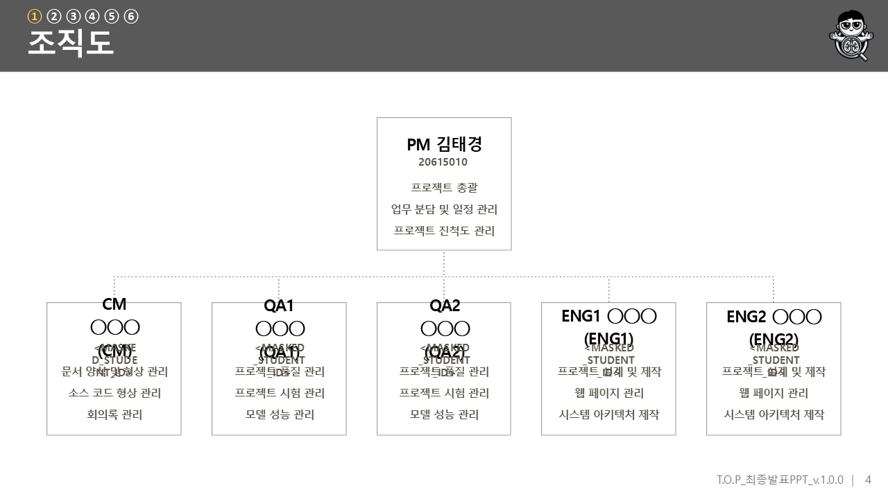

조직도상 본인은 **프로젝트 총괄 · 업무 분담 및 일정 관리 · 진척도 관리** 를 맡았습니다. 이 책임은 산출물에 데이터로 박혀 있습니다:

| 지표 | 값 |
|---|---|
| 산출물 통합본 166 페이지 중 *"김태경"* 명시 | **143 페이지 (86%)** |
| 그중 *"PM 김태경"* (명시적 책임자) | **129 페이지 (78%)** |

166 페이지 산출물의 86% 에 본인 이름이, 78% 에 *"PM 김태경"* 이라는 책임자 표기가 들어 있습니다. PM 역할이 단순 직함이 아니라 모든 산출물의 책임자로 일관되게 기록되었음을 보여줍니다.

### 트랙 2 — 1차 저자 산출물 5 종

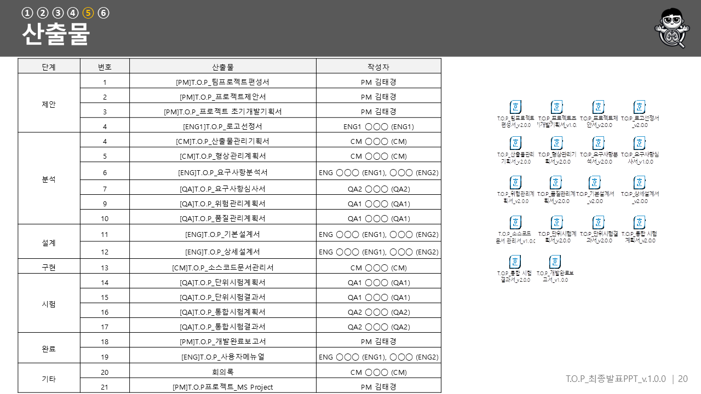

산출물 21 종 중 **5 종을 본인이 1차 저자로 작성**했습니다:

| 산출물 | 페이지 |
|---|---|
| 팀프로젝트 편성서 (v2.0.0) | 4 |
| 프로젝트 제안서 (v2.0.0) | 5 |
| 프로젝트 초기 개발 기획서 (v1.0.0) | 9 |
| 개발 완료 보고서 (v2.0.0) | 9 |
| MS Project (일정 관리) | (별도) |

이 4 개 문서산출물 27 페이지를 한 파일로 추출한 것이 [`docs/deliverables_authored_by_kim_taekyoung.pdf`](docs/deliverables_authored_by_kim_taekyoung.pdf) 입니다 (팀원 PII 는 마스킹). MS Project 일정 관리 파일은 .mpp 포맷이라 별도 보관했고, 간트차트는 [`assets/screenshots/gantt_slide19.png`](assets/screenshots/gantt_slide19.png) 에서 확인할 수 있습니다.

### 트랙 3 — 데이터 전처리 (정직한 모호함)

본인의 코드 영역은 **데이터 전처리 (DICOM → mesh → vertex `.npy` 변환 파이프라인)** 였습니다. [`src/test2.py`](src/test2.py) 안에 관련 함수 12 종 (합계 247 줄) 이 있습니다:

```
find_dicom_files       (DICOM 파일 재귀 검색)
load_scan              (DICOM slice 로드 + ImagePositionPatient 정렬)
get_pixels_hu          (HU, Hounsfield Unit 변환)
resample               (3D zoom, spacing 보정)
segment_lung_mask      (marching cubes 폐 분할)
build_features_from_verts  (vertex 7-feature 생성)
mesh_load_scan / mesh_get_pixels_hu / mesh_resample / mesh_segment_lung_mask
mesh_lung_mask_to_mesh (marching cubes → trimesh)
preprocess_mesh_single (136줄 — MeshCNN 입력 전처리, 가장 큰 함수)
```

### 본인이 담당하지 않은 영역 (데이터로 확인된 정직 표기)

**AI 모델 (4-branch 하이브리드) 의 설계·학습은 ENG1 / ENG2 가 메인**으로 담당했습니다. 이는 추측이 아니라 데이터로 확인됩니다 — 학습 노트북 [`notebooks/Untitled0.ipynb`](notebooks/Untitled0.ipynb) 의 5 개 셀 모두 Google Colab 의 `executionInfo.user` metadata 에 **작성·실행자가 ENG1 (◯◯◯) 으로 자동 기록**되어 있습니다 (해당 메타데이터는 마스킹 처리). Streamlit UI 본체 (`test2.py` 의 웹 페이지 부분) 도 조직도상 ENG 담당입니다.

PM 으로서 팀 전체의 일정과 산출물을 책임지되, AI 모델 학습이라는 핵심 기술 영역은 엔지니어 팀원에게 맡기고 데이터 전처리를 지원했다 — 이것이 본 프로젝트에서 본인의 솔직한 위치입니다.

---

## 📅 프로젝트 일정

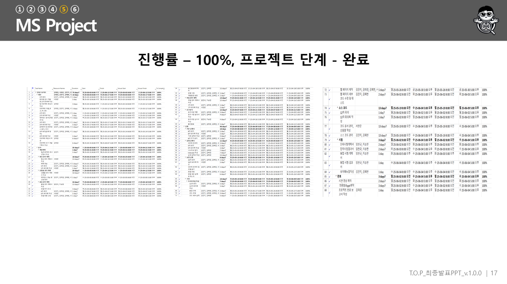

본인이 MS Project 로 작성·관리한 일정표 (발표 slide 19). 2025년 3월 착수 ~ 6월 발표까지 한 학기 동안 데이터 수집·전처리, 모델 설계·학습, Streamlit 통합, 발표 준비를 단계별로 관리했습니다.

---

## 🧪 기대 효과 + 한계

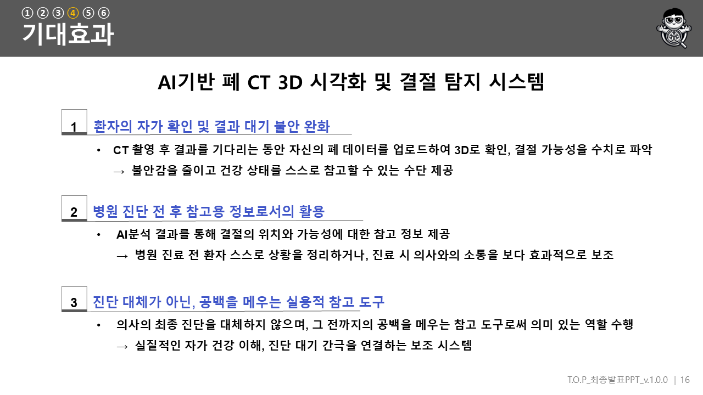

### 기대 효과 (발표 slide 18)
1. 환자의 자가 확인 및 결과 대기 불안 완화
2. 병원 진단 전·후 참고용 정보로서의 활용
3. 진단 대체가 아닌, 공백을 메우는 실용적 참고 도구

### 한계 (정직하게)
- **음성 재현율 19.0%** — 데이터 불균형 문제 (위 [성능](#-데이터셋--학습--성능) 참조)
- **단일 케이스 중심 학습** — 다양한 케이스 확보 필요
- 발표 slide 21 의 향후 개발 계획: *"낮은 '결절 없음' 예측 정확도 향상 / 더 많은 폐 CT 데이터 확보 / 폐 외에도 간·뇌 등 다양한 부위로 확장."*

---

## 📂 자료실

| 자료 | 경로 | 비고 |
|---|---|---|
| 🎤 최종 발표 자료 (44 슬라이드) | [`docs/presentation_final_redacted.pptx`](docs/presentation_final_redacted.pptx) | Git LFS |
| 🪧 판넬 (성과 전시회) | [`docs/panel_v1_redacted.pptx`](docs/) · panel_v2 | Git LFS |
| 📑 개발 완료 보고서 | [`docs/final_report_redacted.pdf`](docs/final_report_redacted.pdf) | 한컴 HWP→PDF 변환 |
| 📑 산출물 통합본 (166p) | [`docs/deliverables_full_redacted.pdf`](docs/deliverables_full_redacted.pdf) | 팀원 PII 마스킹 |
| ★ 📖 본인 1차 저자 산출물 (27p) | [`docs/deliverables_authored_by_kim_taekyoung.pdf`](docs/deliverables_authored_by_kim_taekyoung.pdf) | PM 편성서+제안서+기획서+완료보고서 |
| 🤖 메인 모델 가중치 | [`models/dhkstjd.pth`](models/) | Git LFS (52 MB) |
| 📓 학습 노트북 (Colab) | [`notebooks/Untitled0.ipynb`](notebooks/Untitled0.ipynb) | ENG1 작성 (metadata 확인) |
| 📓 추론·시각화 노트북 | [`notebooks/완성이다.ipynb`](notebooks/) | 한국어 원본명 보존 |
| 📈 학습 로그 (46 epoch) | [`notebooks/training_log.txt`](notebooks/training_log.txt) | loss/F1 진화 |
| 🎬 시연 영상 ×2 | [`assets/videos/`](assets/videos/) | demo_main (0:33) + streamlit_recording (1:26) |
| 🧩 코드 동작용 샘플 | [`data_sample/`](data_sample/) | A0002 한 쌍 (35 KB) |

> 📌 본인을 제외한 팀원 5 명·교수 1 명의 이름은 발표 자료·산출물·메타데이터에서 `◯◯◯` 으로 마스킹되었습니다. 학습 데이터 (645 MB) 와 MS Project 원본 (.mpp) 은 `docs/_archive/local-only/` 에 보관되어 GitHub 에는 push 되지 않습니다. 산출물 PDF 안 회의 사진의 팀원 얼굴도 제거되었습니다.

---

## 📚 참고 자료

본 프로젝트가 인용한 주요 근거 (발표 slide 7, 22-23):
- 환자 정보 단절·대기 불안 관련: O'Sullivan et al. (2017), Munn et al. (2014), Lee & Kim (2023)
- 폐암 사망률 통계: 국가암정보센터·통계청
- 데이터셋: Armato et al., *The Lung Image Database Consortium (LIDC-IDRI)*, Medical Physics (2011)

---

## ✍️ 회고

이 프로젝트는 *"의료 AI"* 라인이 처음 완성된 시점입니다. 이전 [MedQueue](https://github.com/MoriochoRadio/MedQueue), [SchoolbusRFID](https://github.com/MoriochoRadio/SchoolbusRFID), [ElderCaringApp](https://github.com/MoriochoRadio/ElderCaringApp) 까지는 의료·케어 도메인의 *"앱"* 부분이었다면, T.O.P 는 처음으로 본인이 PM 으로 6명 팀을 조율하며 *"AI"* 부분을 본격적으로 도입한 프로젝트입니다.

본인 영역은 PM 의 일정·진척도·업무 분담 관리, 그리고 데이터 전처리 (DICOM → mesh → vertex `.npy` 변환) 였습니다. 4-branch 하이브리드 모델 (SpiralNet + PointNet + Transformer + MeshCNN) 자체는 ENG1/ENG2 가 설계·학습했고, 그 사실은 학습 노트북의 Colab metadata 에 작성자로 자동 박제되어 있습니다. 본인은 산출물 21 종 중 5 종의 1차 저자였고, 166 페이지 산출물 중 143 페이지 (86%) 에 책임자 PM 으로 기록되어 있습니다. 

테스트셋 234건에서 정확도 73.1%, 음성 재현율 19.0% 의 격차는 학부 첫 AI 프로젝트의 데이터 불균형 문제를 그대로 드러냅니다. 발표에서 본인이 직접 *"데이터 불균형 개선 필요"* 라고 인정했고, 이 한계 인식이 다음 프로젝트로 이어졌습니다.

흥미로운 건, 본 발표 PPT 안에 이미 *이전 프로젝트* 와 *다음 프로젝트* 가 모두 박제되어 있다는 점입니다. Slide 40 에는 *"2024 융합설계 II - MAC 메디컬 트윈 폐혈관 모델"* 이 본 프로젝트의 3D 모델링 기술 베이스로 명시되어 있고, Slide 44 (시스템 모듈 구조) 에는 *"간 결절 탐지 모델 모듈"* 이 이미 포함되어 있습니다 — 다음 프로젝트 [AILungandLiver](https://github.com/MoriochoRadio/AILungandLiver) (폐·간 확장) 의 출발점입니다. 의료 영상 AI 의 **3-step 진화 (폐혈관 MAC → 폐 결절 T.O.P → 폐·간 결절 AILungandLiver)** 가 한 발표 자료 안에 박제된 셈입니다. 이 흐름은 이후 [seed-project](https://github.com/MoriochoRadio/seed-project) 캡스톤과 [sperm-ai](https://github.com/MoriochoRadio/sperm-ai) 로도 이어집니다.

학부생으로서 처음 PM 을 맡아 6명의 일정과 산출물을 조율한 경험, 그리고 *"내가 한 부분과 안 한 부분을 정직하게 구분하는 법"* 을 배운 것이 이 프로젝트에서 코드보다 더 오래 남을 것 같습니다.

---

## 🗂️ 관련 레포

### 본 프로젝트가 가능했던 기반
- [`study-java`](https://github.com/MoriochoRadio/study-java) · [`study-windows-programming`](https://github.com/MoriochoRadio/study-windows-programming) — 프로그래밍 기초 학습

### 같은 헬스케어·케어 도메인 (앱·IoT)
- [`MedQueue`](https://github.com/MoriochoRadio/MedQueue) — 병원 실시간 대기 정보 제공 앱 (2024-1)
- [`SchoolbusRFID`](https://github.com/MoriochoRadio/SchoolbusRFID) — 위치 기반 어린이 하차 태그 (2024-2)
- [`ElderCaringApp`](https://github.com/MoriochoRadio/ElderCaringApp) — 독거노인 건강 모니터링 (2024-2)

### ★ 의료 영상 AI 라인 (3-step 진화)
- **MAC** (2024-II) — 메디컬 트윈 폐혈관 모델 *(본 프로젝트의 3D 기술 베이스, PPT slide 40 박제)*
- **LungCT3DNoduleAI** (2025-1, 본 프로젝트) — 폐 CT 결절 탐지 *(본인 PM)*
- [`AILungandLiver`](https://github.com/MoriochoRadio/AILungandLiver) — 폐·간 결절 확장 *(PPT slide 44 박제된 다음 프로젝트)*
- [`sperm-ai`](https://github.com/MoriochoRadio/sperm-ai) — AI 정자 운동성 분석
- [`seed-project`](https://github.com/MoriochoRadio/seed-project) — Team SEED 캡스톤 (현재 진행 중)

---

## License

[`LICENSE.md`](LICENSE.md) 참조. 본 레포는 학부 팀 프로젝트의 학습 결과물을 포트폴리오 목적으로 공개한 것입니다. LIDC-IDRI 데이터셋은 TCIA 의 [Creative Commons Attribution 3.0](https://creativecommons.org/licenses/by/3.0/) 라이선스를 따릅니다. 상업적 이용은 팀 합의가 필요합니다.

---

*Author: [MoriochoRadio](https://github.com/MoriochoRadio) (KimTaeKyoung) · 건양대학교 의료IT공학과 · Team T.O.P PM*
